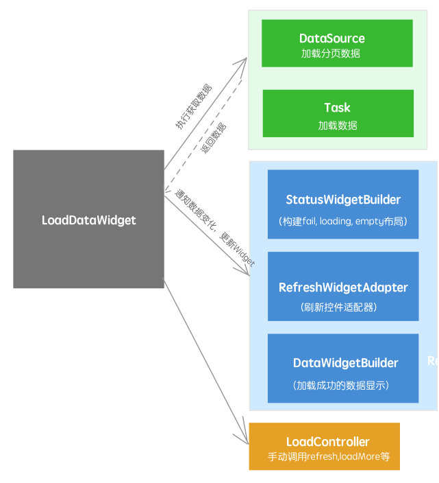
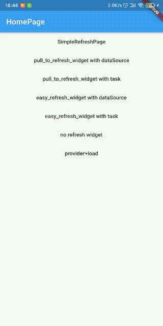

[TOC]

# LoadDataWidget主要功能

1. 集成适配第三方刷新控件，可自由切换刷新框架
2. 分页加载
3. 封装加载中，失败，空数据，成功的界面等界面切换。

## 结构   

   


# 导入方式 #
## 1.必须导入： ##

暂未发布到pub上

	  load_data:
	    git:
	      url: git://github.com/LuckyJayce/flutter_load_data.git

## 2.可选：   ##
1. 如果使用[flutter_pulltorefresh](https://github.com/peng8350/flutter_pulltorefresh)作为刷新可以控件下面方式导入, 并使用PullToRefreshWidgetAdapter

    	//上面链接查看具体版本
    	pull_to_refresh: x.x.x

2. 如果使用[flutter_easyrefresh](https://github.com/xuelongqy/flutter_easyrefresh)作为刷新可以控件下面方式导入，并使用EasyRefreshWidgetAdapter

    ```
    //上面链接查看具体版本
    flutter_easyrefresh: x.x.x
    ```


# 使用方式
## 1.实现DataSource<DATA> 加载数据  
    abstract class DataSource<DATA> {
    	
      ///刷新 触发加载刷新的数据，一般用于加载下拉刷新加载第一页数据
      ///cancelHandle 借鉴于dio类库的设计, 外部通过cancelHandle.cancel()取消，
      ///里面则可以通过cancelHandle.isCanceled()判断，或者通过cancelHandle.interruptedWhenCanceled()当被取消是抛出取消异常终止方法执行
      ///progressCallback，可能为空使用前判空，用于通知外部进度
      ///Future<DATA> 返回数据的Future
      Future<DATA> refresh(CancelHandle cancelHandle, [ProgressCallback progressCallback]);
    
      ///加载更多 触发加载刷新的数据，一般用于列表加载下一页数据
      Future<DATA> loadMore(CancelHandle cancelHandle, [ProgressCallback progressCallback]);
    
      ///是否有更多数据，是否有下一页数据
      bool hasMore();
    }

**Demo 例如：分页加载书籍列表数据**

	///获取列表数据
	class BookListDataSource implements DataSource<List<Book>> {
	  int page;
	
	  @override
	  Future<List<Book>> refresh(CancelHandle cancelHandle, [progressCallback]){
	    return _load(0, cancelHandle, progressCallback);
	  }
	
	  @override
	  Future<List<Book>> loadMore(CancelHandle cancelHandle, [progressCallback]){
	    return _load(page + 1, cancelHandle, progressCallback);
	  }
	
	  @override
	  bool hasMore() {
	    return page < 5;
	  }
	
	  Future<List<Book>> _load(int page, CancelHandle cancelHandle, [progressCallback]) async {
	    //模拟延时
	    await Future.delayed(Duration(seconds: 1));
	    List<Book> list = List.generate(10, (index) => Book('book$page-$index', '${DateTime.now().toString()}'));
	    this.page = page;
	    return list;
	  }
	}

## 2.实现 DataWidgetBuilder显示加载成功的数据	
	///数据加载成功显示的WidgetBuilder
	abstract class DataWidgetBuilder<DATA> {
	  ///获取数据成功后 通过这个方法更新数据
	  ///data DataSource或者task方法的数据，
	  ///refresh 是否是通过DataSource refresh方法返回的，false 表示通过loadMore返回的数据
	  void notifyDataChange(DATA data, bool refresh);
	
	  ///创建显示数据的Widget
	  Widget build(BuildContext context);
	
	  ///是否为空，LoadDataWidget 获取数据成功后，通过这个判断通过StatusWidgetBuilder的empty还是显示DataWidgetBuilder的数据Widget
	  bool isEmpty();
	
	  ///提供外部最终的data
	  DATA getData();
	}

**Demo 例如：显示书籍列表数据**

	class BookListDataWidgetBuilder implements DataWidgetBuilder<List<Book>> {
	  List<Book> list = [];
	  
	  @override
	  void notifyDataChange(List<Book> data, bool refresh) {
	    if (refresh) {
	      list.clear();
	    }
	    list.addAll(data);
	  }
	  
	  @override
	  Widget build(BuildContext context) {
	    return ListView.separated(
	      itemBuilder: (context, index) {
	        Book book = list[index];
	        return ListTile(
	          title: Text('${book.name}'),
	          subtitle: Text('${book.content}'),
	        );
	      },
	      separatorBuilder: (context, index) => Divider(),
	      itemCount: list.length,
	    );
	  }
	
	  @override
	  List<Book> getData() {
	    return list;
	  }
	
	  @override
	  bool isEmpty() {
	    return list.isEmpty;
	  }
	}

## 3.界面配置LoadDataWidget显示 ##    
	  LoadDataWidget.buildByDataSource({
	    @required this.dataSource, //加载数据的dataSource
	    @required this.dataWidgetBuilder, //加载成功数据的widgetBuilder
	    this.controller, //用于外部手动调用refresh，loadMore，addCallback，cancel等功能
	    this.statusWidgetBuilder, //根据加载创建unload,loading,fail,empty等布局，如果不传默认使用DefaultStatusWidgetBuilder()
	    this.firstNeedRefresh = true, //当布局加载的时候是否自动调用刷新加载数据
	    this.refreshWidgetAdapter, //刷新控件适配器，如果不传默认不带有刷新功能
	  });

**Demo 例如:**

	class BookListPage extends StatelessWidget {
	  @override
	  Widget build(BuildContext context) {
	    return Scaffold(
	      appBar: AppBar(
	        title: Text('BookList'),
	      ),
	      body: LoadDataWidget<List<Book>>.buildByDataSource(
	          refreshWidgetAdapter: PullToRefreshWidgetAdapter(),
	          dataSource: MyBookListDataSource(context),
	          dataWidgetBuilder: MyBookDataWidgetBuilder()),
	    );
	  }
	}

上面的PullToRefreshWidgetAdapter也可以切换EasyRefreshWidgetAdapter()

**通过上面3个简单步骤实现一个带有下拉刷新，加载，失败状态切换处理和显示列表数据的页面**

完整代码：[simple_refresh_page](https://github.com/LuckyJayce/flutter_load_data/blob/master/example/lib/pages/simple_refresh_page.dart)

## 4.效果图 ##    




# 自定义

## 1.自定义加载状态布局

```
///状态布局widgetBuilder
abstract class StatusWidgetBuilder {
  Widget buildUnLoadWidget(BuildContext context, [VoidCallback refreshToken]);

  /// 显示加载中
  Widget buildLoadingWidget(
      BuildContext context, int current, int total, Object progressData);

  /// 显示加载失败
  /// @param error
  /// @param refreshToken 可以用于widget点击事件重新刷新
  Widget buildFailWidget(BuildContext context, Object error,
      [VoidCallback refreshToken]);

  /// 显示空数据布局
  /// @param refreshToken 可以用于widget点击事件重新刷新
  Widget buildEmptyWidget(BuildContext context, [VoidCallback refreshToken]);

  /// 有数据的时候，toast提示失败
  /// @param error
  /// @param refreshToken 可以用于widget点击事件重新刷新
  void tipFail(BuildContext context, Object error, [VoidCallback refreshToken]);
}
```

Demo：实现StatusWidgetBuilder 参考：lib里面的 DefaultStatusWidgetBuilder，然后将下面statusWidgetBuilder改为自定义的即可

```
class SimpleRefreshPage extends StatelessWidget {
  @override
  Widget build(BuildContext context) {
    return Scaffold(
      appBar: AppBar(
        title: Text('BookList'),
      ),
      body: LoadDataWidget<List<Book>>.buildByDataSource(
        refreshWidgetAdapter: PullToRefreshWidgetAdapter(),
        dataSource: BookListDataSource(),
        dataWidgetBuilder: BookListDataWidgetBuilder(),
        statusWidgetBuilder: DefaultStatusWidgetBuilder(),
      ),
    );
  }
}
```

License
=======

    MIT License
    
    Copyright (c) 2020 Jayce
    
    Permission is hereby granted, free of charge, to any person obtaining a copy
    of this software and associated documentation files (the "Software"), to deal
    in the Software without restriction, including without limitation the rights
    to use, copy, modify, merge, publish, distribute, sublicense, and/or sell
    copies of the Software, and to permit persons to whom the Software is
    furnished to do so, subject to the following conditions:
    
    The above copyright notice and this permission notice shall be included in all
    copies or substantial portions of the Software.
    
    THE SOFTWARE IS PROVIDED "AS IS", WITHOUT WARRANTY OF ANY KIND, EXPRESS OR
    IMPLIED, INCLUDING BUT NOT LIMITED TO THE WARRANTIES OF MERCHANTABILITY,
    FITNESS FOR A PARTICULAR PURPOSE AND NONINFRINGEMENT. IN NO EVENT SHALL THE
    AUTHORS OR COPYRIGHT HOLDERS BE LIABLE FOR ANY CLAIM, DAMAGES OR OTHER
    LIABILITY, WHETHER IN AN ACTION OF CONTRACT, TORT OR OTHERWISE, ARISING FROM,
    OUT OF OR IN CONNECTION WITH THE SOFTWARE OR THE USE OR OTHER DEALINGS IN THE
    SOFTWARE.
